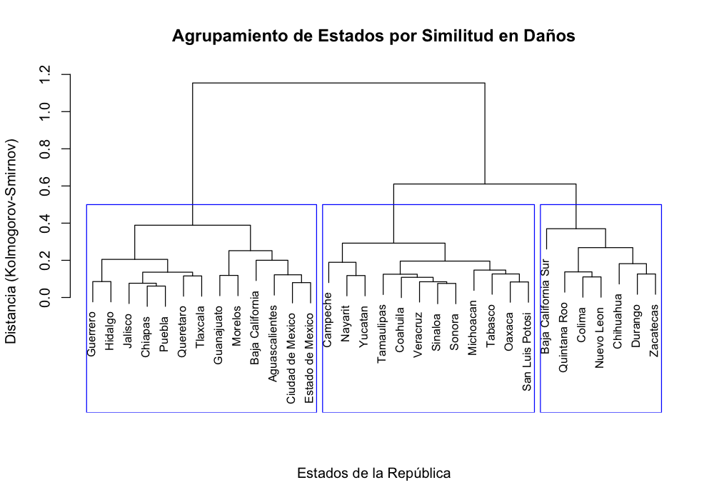
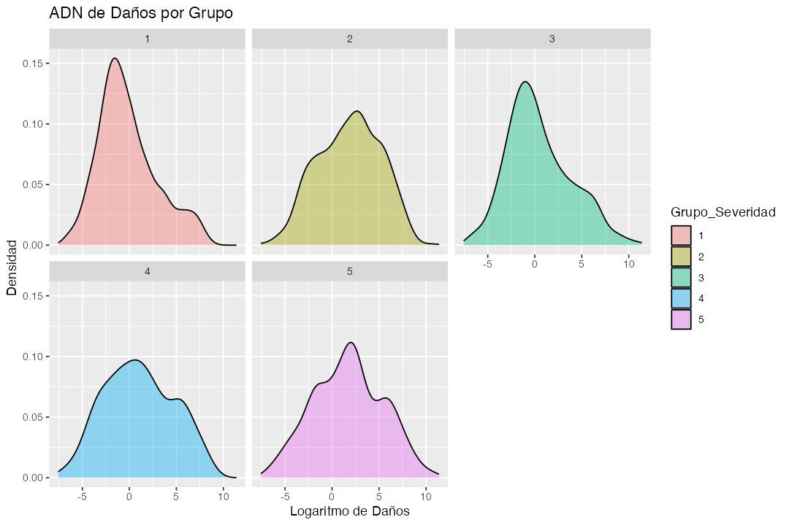
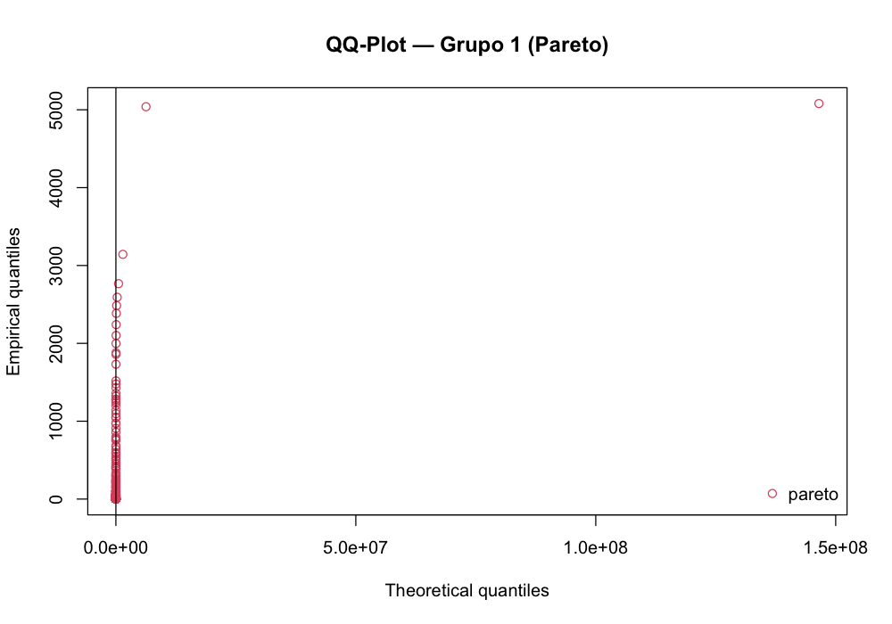

# Modelación de la Severidad de Pérdidas por Fenómenos Hidrometeorológicos en México

Desarrollo de un modelo estadístico y actuarial para cuantificar el impacto
económico de los fenómenos hidrometeorológicos extremos en México. A partir de los
datos históricos del **Atlas Nacional de Riesgos (2000–2024)**, el proyecto combina
**limpieza de datos**, **ajuste por inflación (INPC)**, **clustering jerárquico** y
**modelación de colas pesadas** para estimar el **costo promedio esperado por evento**.

> Proyecto I — Matematicas Actuariales de Seguros de Daños (MASD)

---

## Resumen

El proyecto parte de una base histórica nacional de daños económicos asociados a
eventos hidrometeorológicos y busca responder una pregunta concreta:

> **¿Cuál es el costo promedio esperado de un nuevo evento, considerando que los
> distintos estados presentan perfiles de severidad muy diferentes?**

Para responderla se construyó un flujo completo de análisis en **R** que incluye:

- depuración y transformación de los datos históricos,
- ajuste de los daños a precios constantes de 2024,
- agrupación de estados por similitud en su distribución de pérdidas,
- ajuste de distribuciones de severidad por grupo,
- y la estimación final del costo promedio esperado por evento.

---

## Fuente de datos

- **Base histórica 2000–2024** del **Atlas Nacional de Riesgos**.
- Variables principales: año, clasificación del fenómeno, tipo de fenómeno, estado
  y total de daños.
- El análisis se restringe a eventos con clasificación **hidrometeorológica** y
  daños positivos.

Los montos se expresan en millones de pesos (MDP) y se ajustan a precios de 2024
mediante el **Índice Nacional de Precios al Consumidor (INPC)**.

---

## Metodología

### 1. Limpieza y transformación de datos

Se construyó un flujo de limpieza para dejar una base consistente:

- filtrado de eventos hidrometeorológicos y eliminación de daños en cero,
- imputación de fechas de fin faltantes,
- normalización de nombres de estados y eliminación de acentos,
- reparto proporcional del costo en eventos que afectaron a varios estados,
- y ajuste de los montos a precios constantes de 2024 con el INPC.

### 2. Agrupación de estados por perfil de severidad

Trabajando con el **logaritmo de los daños ajustados**, se construyó una matriz de
distancias entre estados basada en el estadístico de **Kolmogorov-Smirnov** y sobre
ella se aplicó **clustering jerárquico** (método de Ward). El resultado se
consolidó en **5 grupos de severidad**.

### 3. Análisis del "ADN de daños" por grupo

Una vez definidos los grupos, se exploró la distribución de daños de cada uno con
histogramas, densidades y diagramas de caja. Esto justificó modelar la severidad de
forma **segmentada por grupo** en lugar de usar una sola distribución para toda la base.

### 4. Estimación de parámetros y bondad de ajuste

Para cada grupo se compararon distribuciones positivas y de cola pesada
—**Burr, Pareto, Pareto generalizada, Lognormal, Loglogística, Paralogística y
Gamma generalizada**— usando **AIC**, las pruebas de **Kolmogorov-Smirnov** y
**Anderson-Darling**, y gráficos **Q-Q** y **P-P**.

Una idea central del proyecto: en presencia de colas pesadas, la distribución que
mejor describe la forma no siempre es la mejor para estimar un costo promedio útil.
Por eso, en algunos grupos se reporta una distribución de cola pesada para el ajuste,
pero se usa una **Lognormal auxiliar** para obtener una esperanza finita y estable.

---

## Resultado principal

- **Costo promedio esperado por evento en 2024:** 〈1668.037〉 MDP
- **Costo promedio esperado por evento en 2025:** 〈1743.099〉 MDP (inflación supuesta de 4.5%)

---

## Herramientas y librerías

**Lenguaje:** R

**Librerías principales:** `data.table`, `dplyr`, `stringr`, `stringi`, `ggplot2`,
`tidyr`, `magrittr`, `readxl`, `moments`, `fitdistrplus`, `actuar`, `goftest`,
`flexsurv`.

---

## Autores

- Camacho Cruz Ángel Gabriel
- González Hernández Josué Zuriel
- Halave Cubillo Salvador
- López Villegas Saori Kinari
- Reyes Gabriel Ilse Valeria
